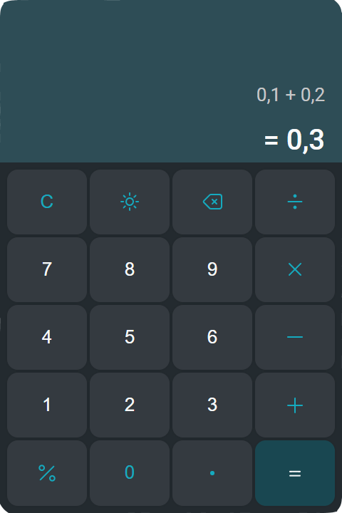
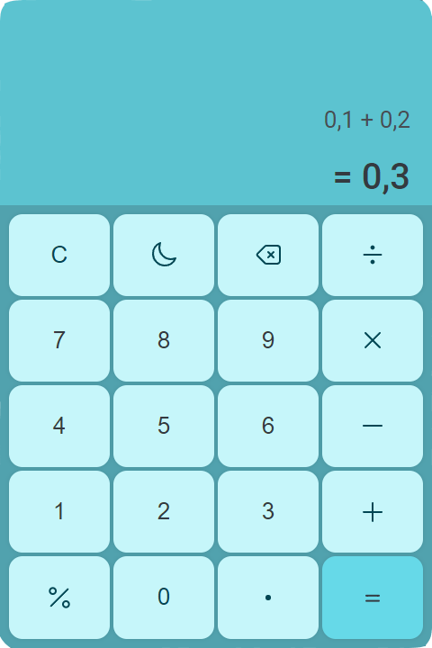

# calculator-app
Calculator app using React, TypeScript, Mobx, Styled Components.

**Deployed Example:**  https://evg-calculator-app.netlify.app

Screenshots:

| Dark theme                                                  | Light theme                                                   |
|-------------------------------------------------------------|---------------------------------------------------------------|
|  |  |

